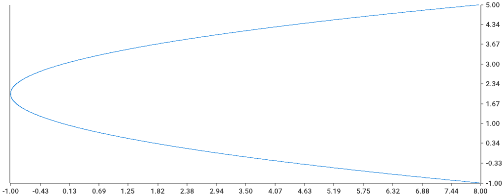
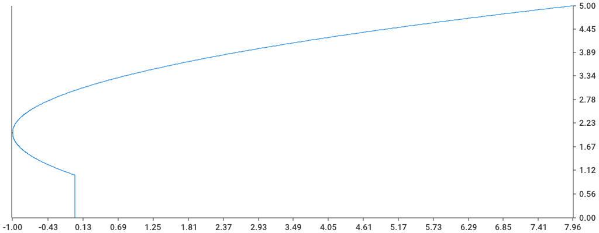

# UC Berkeley | Math 53

**Description**: Parametric equations and polar coordinates. Vectors in 2- and 3-dimensional Euclidean spaces. Partial derivatives. Multiple integrals. Vector calculus. Theorems of Green, Gauss, and Stokes. (F,SP)

**Textbook**: Stewart, Multiple Variable Calculus. A specially priced UC Berkeley paperback edition is available.

## Chapter 10.1

### Example 1

```bash
go run 10_1/example_1/example_1.go
```



